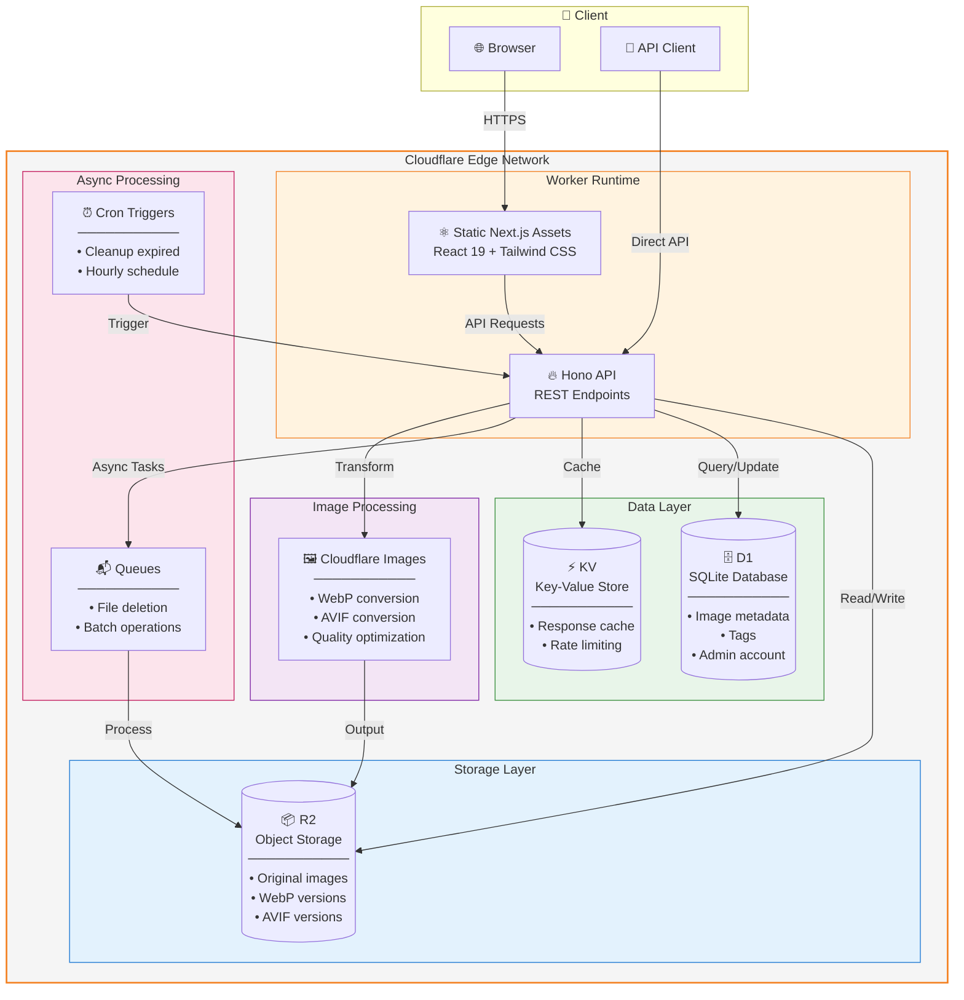

# CattoPic

A self-hosted image hosting service with automatic format conversion, tag management, and a random image API. Built with Next.js frontend and Cloudflare Workers backend.

[中文文档](./docs/README_CN.md)

## Architecture



### Component Overview

| Component | Service | Purpose |
|-----------|---------|---------|
| **Frontend + API** | Cloudflare Worker | Next.js static Assets + Hono API |
| **Storage** | Cloudflare R2 | Store original and converted images (WebP/AVIF) |
| **Database** | Cloudflare D1 | Image metadata, tags, admin account (SQLite) |
| **Cache** | Cloudflare KV | Response caching, reduce D1 queries |
| **Queue** | Cloudflare Queues (optional) | Async file deletion, batch processing |
| **Images** | Cloudflare Images | On-the-fly format conversion and optimization |
| **Cron** | Cron Triggers | Scheduled cleanup of expired images |

## Features

- **Multi-format Support** - Upload JPEG, PNG, GIF, WebP, AVIF images
- **Automatic Conversion** - Auto-generate WebP and AVIF versions for optimal delivery
- **Tag Management** - Organize images with tags, batch operations supported
- **Random Image API** - Public API for random images with filtering options
- **Expiry Support** - Set expiration time for temporary images
- **Modern UI** - Clean management interface with dark mode support

## Tech Stack

| Component | Technology |
|-----------|------------|
| Frontend | Next.js 16, React 19, Tailwind CSS |
| Backend | Cloudflare Workers, Hono |
| Storage | Cloudflare R2 |
| Database | Cloudflare D1 (SQLite) |
| Cache | Cloudflare KV |

## Quick Start

### Prerequisites

- Node.js >= 24
- [pnpm](https://pnpm.io/) package manager
- [Cloudflare account](https://dash.cloudflare.com/)

### 1. Clone and Install

```bash
git clone https://github.com/yourusername/cattopic.git
cd cattopic
pnpm install
cd worker && pnpm install
```

### 2. Setup Cloudflare Resources

```bash
cd worker
pnpm wrangler login

# Create R2 bucket
pnpm wrangler r2 bucket create cattopic-r2

# Create D1 database
pnpm wrangler d1 create CattoPic-D1
# Note the database_id from output

# Create KV namespace
pnpm wrangler kv namespace create CACHE_KV
# Note the id from output

# (Optional) Create Queue - only needed if USE_QUEUE = 'true'
# Requires Cloudflare Workers Paid plan
pnpm wrangler queues create cattopic-delete-queue

# Initialize database schema
pnpm wrangler d1 execute CattoPic-D1 --remote --file=schema.sql
```

### 3. Configure Worker

Production deployment uses the committed `worker/wrangler.prod.toml`. Replace the resource IDs and public domains if you deploy to your own Cloudflare account:

```toml
[vars]
R2_PUBLIC_URL = 'https://your-r2-domain.com'
CORS_ORIGINS = 'https://your-worker-domain.com'
# Set to 'true' to use Cloudflare Queues for async R2 deletion
# Set to 'false' or remove for synchronous deletion (no Queue required)
USE_QUEUE = 'false'

[[r2_buckets]]
bucket_name = 'cattopic-r2'

[[d1_databases]]
database_name = 'CattoPic-D1'
database_id = '<your-database-id>'

[[kv_namespaces]]
id = "<your-kv-id>"

[assets]
directory = '../out'
binding = 'ASSETS'
html_handling = 'auto-trailing-slash'

# (Optional) Only needed if USE_QUEUE = 'true'
# [[queues.producers]]
# queue = "cattopic-delete-queue"
#
# [[queues.consumers]]
# queue = "cattopic-delete-queue"
```

### 4. Build and Deploy the Single Worker

```bash
pnpm install --frozen-lockfile
pnpm build
pnpm -C worker install --frozen-lockfile
pnpm -C worker wrangler deploy --config wrangler.prod.toml
```

The generated `out/` directory is served by the same Worker. Requests under `/api/*` are handled by Hono.

**GitHub Actions**

GitHub Actions deployment avoids configuration conflicts when syncing upstream.

1. **Create API Token**: Go to [Cloudflare API Tokens](https://dash.cloudflare.com/profile/api-tokens) → Create Token → Use "Edit Cloudflare Workers" template

2. **Get Account ID**: Run `pnpm wrangler whoami` to find your Account ID

3. **Configure GitHub Secrets** (Settings → Secrets and variables → Actions):

| Secret | Description |
|--------|-------------|
| `CLOUDFLARE_API_TOKEN` | Your API Token |
| `CLOUDFLARE_ACCOUNT_ID` | Your Account ID |

4. **Trigger**: Push frontend or Worker changes to `main`, or manually trigger via Actions tab

### 5. 初始化管理员账号（网页）

部署前端后，首次打开 `/admin/setup` 页面，在网页中创建管理员账号（用户名 + 密码，PBKDF2 哈希存 D1）。之后通过 `/admin/login` 登录后台。

> 旧版基于 API Key 的鉴权已移除；`api_keys` 表保留但不再使用。

### 6. Access the Frontend

The Worker URL serves both the frontend and API. No `NEXT_PUBLIC_API_URL` is required in production because API requests use the same origin.

Open `/admin/setup` on the Worker domain to create the first administrator. Protected management and upload APIs require the username/password session; `/api/random` remains public.

## Upgrading Existing Deployments

`schema.sql` is the baseline for new installations. Existing deployments should keep their current D1 database. The current release creates the `admin_users` table lazily when setup or login is first called; the legacy `api_keys` table, if present, is no longer used.

This release adds a `deletion_jobs` table for reliable R2 cleanup. Existing deployments do not need a manual D1 migration command: the Worker creates the table through the D1 binding the first time delete/cleanup code needs it.

### Fork + GitHub Actions

1. Sync or merge upstream changes into your fork.
2. Keep your existing GitHub Secrets: `CLOUDFLARE_API_TOKEN` and `CLOUDFLARE_ACCOUNT_ID`.
3. Push to `main` or run the `Deploy Worker` workflow manually.
4. No D1 command is required for this upgrade.

### Local Pull + Manual Deploy

```bash
git pull
npx --yes pnpm@10.24.0 install --frozen-lockfile
npx --yes pnpm@10.24.0 run build
npx --yes pnpm@10.24.0 -C worker install --frozen-lockfile
npx --yes pnpm@10.24.0 -C worker exec tsc --noEmit
npx --yes pnpm@10.24.0 -C worker exec wrangler deploy --config wrangler.prod.toml
```

No API key rotation is required. Create or change the administrator from the web interface; passwords are stored as PBKDF2 hashes and sessions are stored in KV.

## API Overview

### Public Endpoints

#### Random Image

```bash
GET /api/random
```

Returns a random image. Supports filtering:

```bash
# Get random landscape image
curl "https://api.example.com/api/random?orientation=landscape"

# Filter by tags
curl "https://api.example.com/api/random?tags=nature,outdoor"

# Exclude tags
curl "https://api.example.com/api/random?exclude=private"

# Request specific format
curl "https://api.example.com/api/random?format=webp"

# Combine filters
curl "https://api.example.com/api/random?orientation=portrait&tags=cat&format=avif"
```

| Parameter | Values | Description |
|-----------|--------|-------------|
| `orientation` | `landscape`, `portrait`, `auto` | Image orientation (auto detects from User-Agent) |
| `tags` | comma-separated | Include images with ALL specified tags |
| `exclude` | comma-separated | Exclude images with ANY specified tags |
| `format` | `original`, `webp`, `avif` | Response format (auto-negotiated if not specified) |

### Protected Endpoints

All management endpoints require the administrator session cookie created by `/api/auth/login`:

```bash
Cookie: cattopic_session=<HttpOnly session token>
```

| Method | Endpoint | Description |
|--------|----------|-------------|
| POST | `/api/upload/single` | Upload image |
| GET | `/api/images` | List images (paginated) |
| GET | `/api/images/:id` | Get image details |
| PUT | `/api/images/:id` | Update image metadata |
| DELETE | `/api/images/:id` | Delete image |
| GET | `/api/tags` | List all tags |
| POST | `/api/tags` | Create tag |
| PUT | `/api/tags/:name` | Rename tag |
| DELETE | `/api/tags/:name` | Delete tag and associated images |
| POST | `/api/tags/batch` | Batch tag operations |

## Documentation

- [Deployment Guide](./DEPLOYMENT.md) (Chinese)
- [Deployment Guide](./docs/DEPLOYMENT_EN.md) (English)
- [API Documentation](./docs/API.md) (Chinese)
- [API Documentation](./docs/API_EN.md) (English)

## Local Development

```bash
# Terminal 1: Start worker
cd worker
pnpm dev

# Terminal 2: Start frontend
pnpm dev
```

Create `.env.local`:

```env
NEXT_PUBLIC_API_URL=http://localhost:8787
```

## License

[GPL-3.0](./LICENSE)
